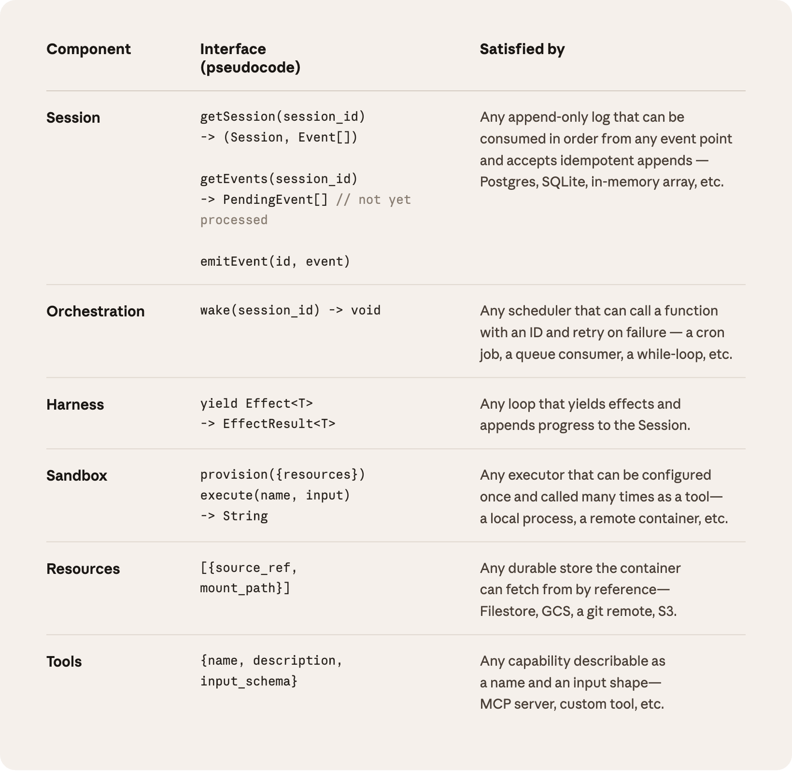

*想上手 Claude Managed Agents，请参阅我们的[文档](https://platform.claude.com/docs/en/managed-agents/overview)。*

在这个工程博客上，我们反复讨论过一个话题：如何[构建高效的智能体](https://www.anthropic.com/engineering/building-effective-agents)，以及如何为[长时间运行的任务](https://www.anthropic.com/engineering/harness-design-long-running-apps)[设计 harness](https://www.anthropic.com/engineering/effective-harnesses-for-long-running-agents)（即驱动模型运转的外层框架）。这些工作有一条共同的主线：harness 本质上是在编码"Claude 自己做不到什么"这类假设。可这些假设必须经常被重新审视，因为随着模型能力提升，它们会[逐渐失效](http://www.incompleteideas.net/IncIdeas/BitterLesson.html)。

举一个例子。在之前的工作中[我们发现](https://www.anthropic.com/engineering/harness-design-long-running-apps)，Claude Sonnet 4.5 一旦察觉上下文窗口快要用完，就会草草收尾——这种行为有时被称作"上下文焦虑"。我们的应对办法是在 harness 里加入上下文重置机制。但当我们把同一套 harness 用在 Claude Opus 4.5 上时，这个行为消失了。那些重置逻辑成了累赘。

我们预期 harness 会持续演进。于是我们构建了 Managed Agents：这是 Claude Platform 中的一项托管服务，替你运行长程智能体，对外只暴露一小组接口。这组接口的设计目标，是比任何一种具体实现都活得更久——包括我们今天正在运行的那些。

构建 Managed Agents，意味着要解决计算领域的一个老问题：如何为"[尚未被想到的程序](http://www.catb.org/esr/writings/taoup/html/ch03s01.html)"设计系统。几十年前，操作系统的解法是把硬件虚拟化成抽象——*进程*、*文件*——这些抽象足够通用，能容纳当时还不存在的程序。抽象比硬件活得更久。`read()` 这个调用并不关心它读的是 1970 年代的磁盘组，还是今天的 SSD。上层抽象保持稳定，底层实现随意更换。

Managed Agents 沿用了同样的思路。我们把智能体的各个组件虚拟化了：**会话**（session，一份只追加的日志，记录发生过的一切）、**harness**（一个循环，负责调用 Claude，并把 Claude 发出的工具调用路由到相应的基础设施）、以及**沙箱**（sandbox，一个执行环境，Claude 可以在里面运行代码、编辑文件）。这样一来，任何一个组件的实现都可以单独替换，而不会波及其他组件。我们对这些接口的形态有明确的主张，但对接口背后跑的是什么，并不设限。

## 别养宠物

一开始，我们把智能体的所有组件塞进同一个容器，也就是说会话、harness 和沙箱共享同一个环境。这种做法有它的好处：文件编辑就是直接的系统调用，也不需要设计任何服务边界。

但把一切耦合在一个容器里，我们撞上了一个基础设施领域的老问题：我们养了一只[*宠物*](https://cloudscaling.com/blog/cloud-computing/the-history-of-pets-vs-cattle/)。在"宠物与牲口"的比喻里，宠物是有名字、需要精心照料、丢了就心疼的个体；牲口则是可以随意替换的。在我们的场景里，服务器就成了那只宠物：容器一挂，会话就丢了；容器没响应，我们就得把它一点点救活。

"救活容器"意味着要调试那些卡死的会话。我们唯一的观察窗口是 WebSocket 事件流，但它没法告诉我们故障*出在哪里*——harness 里的一个 bug、事件流中的一次丢包、容器掉线，在事件流里看起来一模一样。要弄清楚到底出了什么问题，工程师得进到容器里开一个 shell。可这个容器往往还装着用户数据，所以这条路实际上走不通，等于我们根本没有调试能力。

第二个问题是，harness 默认假设 Claude 要操作的东西都和它待在同一个容器里。当客户希望把 Claude 接入他们自己的 VPC（虚拟私有云）时，他们要么得把自己的网络和我们的网络做对等连接，要么得在自己的环境里跑我们的 harness。一个被写死在 harness 里的假设，在我们想把它接到不同基础设施上时，就成了障碍。

## 让大脑与双手解耦

我们最终的解法，是把我们称为"大脑"的部分（Claude 及其 harness），与"双手"（真正执行动作的沙箱和工具）以及"会话"（会话事件的日志）彼此解耦。每一部分都成为一个接口，对其他部分几乎不做假设；每一部分都可以独立失败、独立替换。

**Harness 搬出容器。** 大脑与双手解耦，意味着 harness 不再住在容器里。它调用容器的方式和调用任何其他工具一样：`execute(name, input) → string`。容器变成了牲口。如果容器挂了，harness 会把它当作一次工具调用错误捕获，然后交还给 Claude。如果 Claude 决定重试，就可以按标准配方重新初始化一个新容器：`provision({resources})`。我们再也不必费心把挂掉的容器救活了。

**从 harness 故障中恢复。** Harness 自己也变成了牲口。因为会话日志放在 harness 之外，harness 内部没有任何东西需要在崩溃后幸存。当一个 harness 挂掉，可以用 `wake(sessionId)` 拉起一个新的，用 `getSession(id)` 取回事件日志，然后从最后一个事件处继续。在智能体循环运行期间，harness 通过 `emitEvent(id, event)` 向会话写入事件，以保证有一份持久的记录。

**安全边界。** 在耦合式设计里，Claude 生成的任何不可信代码，都和凭据跑在同一个容器里——于是一次提示注入只需要说服 Claude 读一下自己的环境变量就够了。攻击者一旦拿到这些令牌，就能开启全新的、不受限制的会话，并把工作委派给它们。缩小令牌的权限范围是一种显而易见的缓解手段，但这又是在编码一种假设：Claude 拿着受限令牌干不了什么——而 Claude 正在变得越来越聪明。结构性的修复方案是：确保令牌永远无法从运行 Claude 生成代码的沙箱中触达。

我们用了两种模式来保证这一点。认证信息要么与资源绑定打包，要么存放在沙箱之外的保险库里。对于 Git，我们在沙箱初始化阶段用每个仓库的访问令牌克隆代码，并把它配置进本地的 git remote。之后在沙箱内部执行 `push` 和 `pull` 都能正常工作，而智能体自己从头到尾都碰不到令牌。对于自定义工具，我们支持 MCP，并把 OAuth 令牌存放在安全的保险库中。Claude 通过一个专用代理调用 MCP 工具；这个代理接收一个与会话关联的令牌，据此从保险库中取出对应的凭据，再去调用外部服务。Harness 始终对任何凭据一无所知。

## 会话不是 Claude 的上下文窗口

长程任务经常会超出 Claude 上下文窗口的长度，而应对这一问题的标准做法，都涉及"保留什么、丢弃什么"的不可逆决策。我们在之前关于上下文工程的[工作](https://www.anthropic.com/engineering/effective-context-engineering-for-ai-agents)中探讨过这些技术。例如，压缩（compaction）让 Claude 把上下文窗口的内容保存为一份摘要；记忆工具让 Claude 把上下文写进文件，从而实现跨会话学习。这些还可以与上下文裁剪配合使用，后者会有选择地移除某些 token，比如陈旧的工具结果或思考块。

但这种有选择地保留或丢弃上下文的不可逆决策，可能导致失败。很难预知未来的轮次会用到哪些 token。如果消息经过了压缩步骤的转换，harness 就会把被压缩的消息从 Claude 的上下文窗口中移除，而它们只有在被另行存储的情况下才可能找回。此前已有研究[探索过](https://arxiv.org/pdf/2512.24601)解决这一问题的思路：把上下文存为一个位于上下文窗口*之外*的对象。例如，上下文可以是 REPL 中的一个对象，LLM 通过编写代码对其进行过滤或切片，以编程方式访问它。

在 Managed Agents 中，会话提供了同样的好处：它是一个位于 Claude 上下文窗口之外的上下文对象。不过，上下文并不是存放在沙箱或 REPL 里，而是持久地保存在会话日志中。通过 `getEvents()` 这个接口，大脑可以按位置选取事件流的切片，从而查询上下文。这个接口用法很灵活：大脑可以从上次读到的地方继续，可以在某个时刻之前回退几个事件看看前因，也可以在执行某个特定动作前重读相关上下文。

取回的任何事件，在传入 Claude 的上下文窗口之前，还可以在 harness 中进行转换。这些转换可以是 harness 编码的任何逻辑，包括为提高提示缓存命中率而做的上下文组织，以及各种上下文工程手段。我们把"可恢复的上下文存储"放在会话里，把"任意的上下文管理"放在 harness 里，二者关注点分离——因为我们无法预测未来的模型需要什么样的上下文工程。这组接口把上下文管理推给了 harness，自己只保证一件事：会话是持久的，并且随时可供查询。

## 多个大脑，多双手

**多个大脑。** 大脑与双手解耦，解决了我们最早收到的客户投诉之一。当团队希望 Claude 操作他们自己 VPC 里的资源时，唯一的路径是把他们的网络和我们的做对等连接，因为承载 harness 的容器默认所有资源都在它旁边。一旦 harness 不再住在容器里，这个假设就不存在了。同一个改动还带来了性能上的回报。当初我们把大脑放进容器时，多少个大脑就需要多少个容器。对每一个大脑来说，容器没有就绪，推理就无法开始；每个会话都得预先付出完整的容器启动成本。每个会话——哪怕是那些永远不会碰沙箱的——都得克隆仓库、启动进程、从我们的服务器拉取待处理事件。

这段空等的时间体现在首 token 延迟（TTFT，time-to-first-token）上，它衡量的是一个会话从接下任务到产出第一个响应 token 之间要等多久。TTFT 是用户*感受*最强烈的那种延迟。

大脑与双手解耦之后，容器由大脑通过一次工具调用（`execute(name, input) → string`）按需创建，只在真正需要时才会去申请。所以一个暂时不需要容器的会话，也就不必等它。只要编排层从会话日志中拉取到待处理事件，推理就可以立刻开始。采用这一架构后，我们的 TTFT p50 下降了大约 60%，p95 下降超过 90%。扩展到多个大脑，无非是启动多个无状态的 harness，再在需要时把它们接到双手上。

**多双手。** 我们还希望每个大脑都能接上多双手。在实践中，这意味着 Claude 必须对多个执行环境进行推理，并决定把工作发到哪里——这比在单个 shell 里操作要难得多。我们一开始把大脑放在单个容器里，正是因为早期模型还做不到这一点。随着智能水平提升，单个容器反而成了瓶颈：那个容器一旦失败，大脑伸向的每一双手的状态都会一起丢失。

大脑与双手解耦之后，每一双手都是一个工具：`execute(name, input) → string`——传入名称和输入，返回一个字符串。这个接口支持任何自定义工具、任何 MCP 服务器，以及我们自己的工具。Harness 并不知道沙箱究竟是一个容器、一部手机，还是一个宝可梦模拟器。而且因为没有任何一双手绑定在某个大脑上，大脑之间可以把手互相传递。

## 结语

我们面对的挑战是一个老问题：如何为"尚未被想到的程序"设计系统。操作系统之所以能延续几十年，是因为它把硬件虚拟化成了足够通用的抽象，能容纳当时还不存在的程序。通过 Managed Agents，我们的目标是设计一个系统，能够容纳未来围绕 Claude 出现的各种 harness、沙箱或其他组件。

Managed Agents 是同一精神下的"元 harness"：它对 Claude 未来需要的*具体* harness 不持立场。它是一个拥有通用接口的系统，可以承载许多不同的 harness。例如，Claude Code 是一个出色的 harness，我们在各类任务中广泛使用；我们也曾证明，面向特定任务的智能体 harness 在狭窄领域表现优异。Managed Agents 可以容纳其中任何一种，随着时间推移与 Claude 的智能水平相匹配。

元 harness 的设计，意味着要对 Claude 周围的接口持有明确主张：我们预期 Claude 需要操纵状态（会话）和执行计算（沙箱）的能力，也预期 Claude 需要扩展到多个大脑和多双手。我们设计这些接口，是为了让它们能在长时间跨度内可靠、安全地运行。但对于 Claude 需要多少个大脑、多少双手，以及它们位于何处，我们不做任何假设。

## 致谢

本文由 Lance Martin、Gabe Cemaj 和 Michael Cohen 撰写。感谢 Nodir Turakulov 和 Jeremy Fox 就这些话题进行的有益讨论。特别感谢 Agents API 团队和 Jake Eaton 的贡献。

## 原文

原文为 Anthropic 官方博客文章，版权归 Anthropic 所有，此处不整篇转载，请直接阅读原文：

**Scaling Managed Agents: Decoupling the brain from the hands** — https://www.anthropic.com/engineering/managed-agents

（Lance Martin, Gabe Cemaj & Michael Cohen, Anthropic Engineering, Apr 8, 2026）
