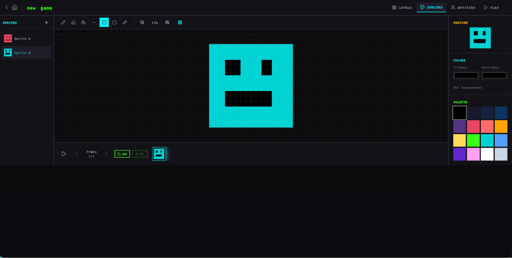
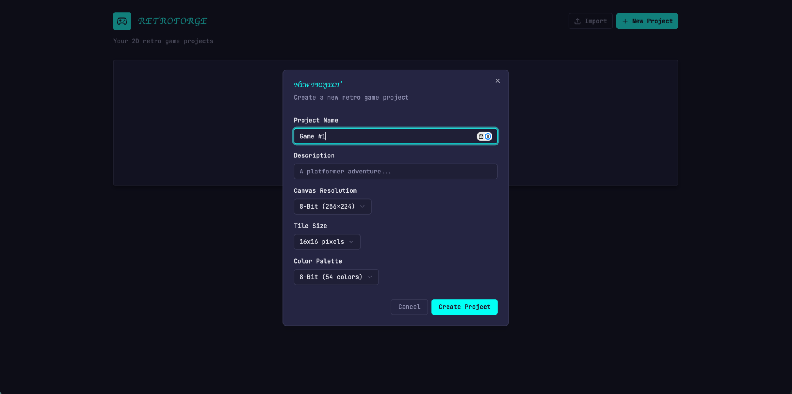
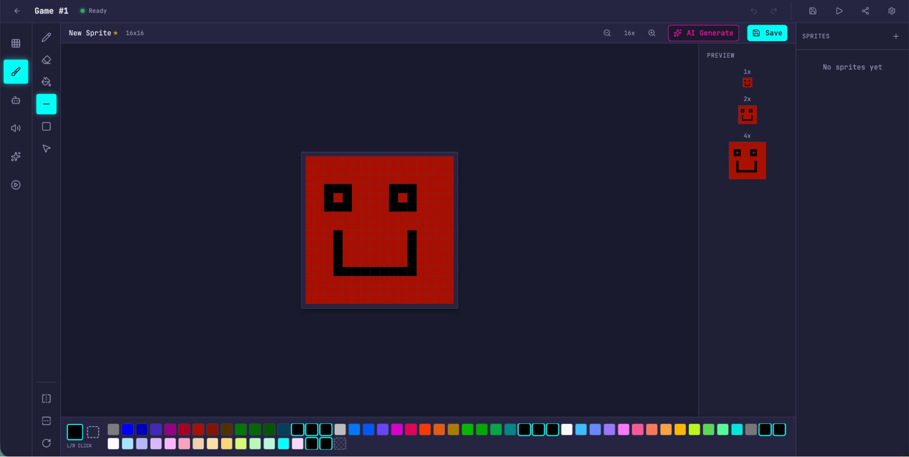
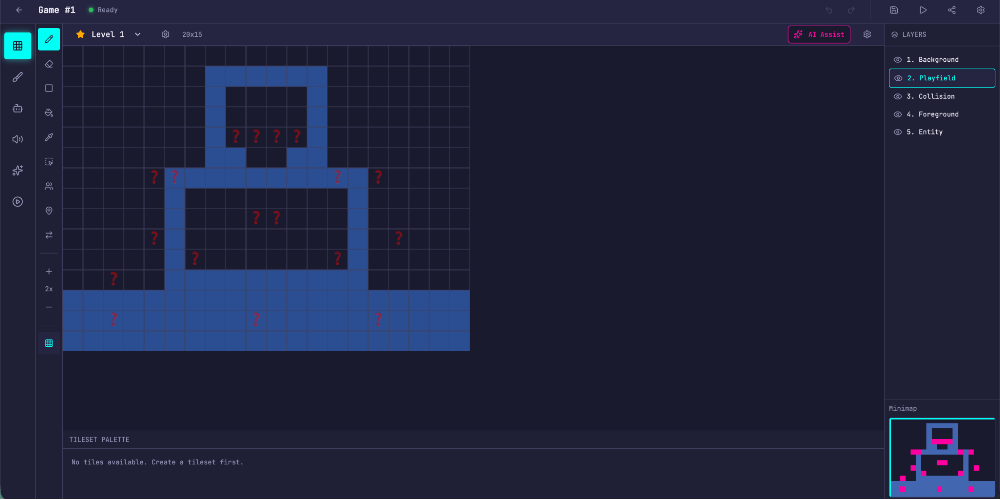
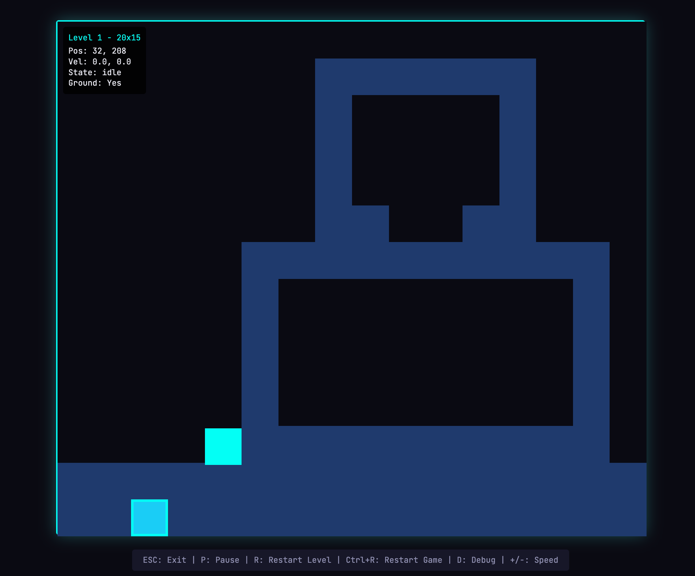

*本文作者 Prithvi Rajasekaran，Anthropic [Labs](https://www.anthropic.com/news/introducing-anthropic-labs) 团队成员。*

过去几个月，我一直在啃两个相互关联的问题：一是让 Claude 产出高质量的前端设计，二是让它在没有人工干预的情况下构建出完整的应用。这项工作源自我们早先在[前端设计 skill](https://github.com/anthropics/claude-code/blob/main/plugins/frontend-design/skills/frontend-design/SKILL.md) 和[长时运行编程智能体 harness](https://www.anthropic.com/engineering/effective-harnesses-for-long-running-agents) 上的探索。当时我和同事们通过提示词工程和 harness 设计，把 Claude 的表现拉到了远高于基线的水平——但两条线最终都撞上了天花板。

为了突破，我开始寻找能同时适用于两个截然不同领域的新型 AI 工程方法：一个领域由主观品味定义，另一个则由可验证的正确性与可用性定义。受[生成对抗网络](https://en.wikipedia.org/wiki/Generative_adversarial_network)（GAN）的启发，我设计了一个包含**生成器**（generator）和**评估器**（evaluator）两个智能体的多智能体结构。要造出一个能可靠打分、还带点品味的评估器，首先得建立一套标准，把"这个设计好不好？"这类主观判断转化成具体、可打分的条目。

接着我把这些技术用到长时运行的自主编程上，并沿用了早先 harness 工作中的两条经验：把构建过程拆成可控的小块；用结构化产物在会话之间传递上下文。最终成果是一个三智能体架构——规划器、生成器、评估器——它能在长达数小时的自主编程会话里，产出功能丰富的全栈应用。

## 为什么朴素的实现走不远

我们之前已经证明，harness 设计对长时运行智能体编程的效果影响很大。在早先的一次[实验](https://www.anthropic.com/engineering/effective-harnesses-for-long-running-agents)中，我们用一个初始化智能体把产品规格拆成任务列表，再由一个编程智能体逐个功能地实现任务，并在会话之间交接产物以延续上下文。更广泛的开发者社区也得出了类似的结论，比如"[Ralph Wiggum](https://ghuntley.com/ralph/)"方法，用 hook 或脚本让智能体保持在持续迭代的循环里。

但有些问题始终挥之不去。面对更复杂的任务，智能体随着时间推移仍然容易跑偏。拆解这个问题时，我们观察到智能体执行此类任务时有两种常见的失败模式。

第一，随着上下文窗口逐渐填满，模型在长任务上往往会失去连贯性（参见我们关于[上下文工程](https://www.anthropic.com/engineering/effective-context-engineering-for-ai-agents)的文章）。有些模型还表现出"上下文焦虑"（context anxiety）：当它们觉得自己快要触及上下文上限时，就开始草草收尾。上下文重置——把上下文窗口彻底清空、启动一个全新的智能体，再配上一份携带前一个智能体状态和后续步骤的结构化交接——能同时解决这两个问题。

这和压缩（compaction）不同。压缩是把对话的前半部分就地总结，让同一个智能体在缩短后的历史上继续干活。压缩虽然保住了连续性，却没有给智能体一块白板，所以上下文焦虑仍可能存在。重置提供了白板，代价是交接产物必须带有足够的状态，好让下一个智能体干净地接手。在我们早先的测试中，Claude Sonnet 4.5 的上下文焦虑相当明显，光靠压缩不足以支撑出色的长任务表现，于是上下文重置成了 harness 设计中不可或缺的一环。这解决了核心问题，但也给每次 harness 运行增加了编排复杂度、token 开销和延迟。

第二个问题我们之前没有处理过，那就是自我评估。当被要求评估自己产出的工作时，智能体往往会自信地夸奖一番——哪怕在人看来质量明显平平。这个问题在设计这类主观任务上尤其突出，因为那里没有类似可验证软件测试那样的二元检查。一个布局是精致还是平庸，是个判断题，而智能体给自己打分时总是可靠地偏向乐观。

不过，即便是结果可验证的任务，智能体在执行过程中有时也会表现出糟糕的判断力，拖累自己的表现。把干活的智能体和评判的智能体分开，是解决这个问题的一个有力杠杆。这种分离本身并不能立刻消除宽纵——评估器仍然是一个 LLM，天然倾向于对 LLM 生成的输出宽容。但事实证明，把一个独立的评估器调得多疑，比让生成器对自己的工作挑剔要容易得多；而一旦有了这份外部反馈，生成器就有了具体的迭代目标。

## 前端设计：让主观质量可打分

我从前端设计开始实验，因为自我评估的问题在这里最显眼。不加任何干预的话，Claude 通常会倾向于安全、可预测的布局：技术上能用，视觉上毫无亮点。

两点认识塑造了我为前端设计搭建的 harness。第一，虽然美学不能完全归结为一个分数——而且各人品味永远有差异——但通过一套把设计原则和偏好编码进去的评分标准，美学是可以被提升的。"这个设计美吗？"很难回答得一致，而"这个设计是否遵循了我们的好设计原则？"就给了 Claude 一个具体的打分依据。第二，把前端生成和前端评分分开，就能形成一个反馈闭环，推着生成器往更强的输出走。

带着这个思路，我写了四条评分标准，同时放进生成器和评估器的提示词里：

- **设计质量：** 这个设计给人的感觉是一个连贯的整体，还是一堆零件的拼凑？做得好意味着色彩、字体、布局、图像等各种细节合在一起，营造出独特的氛围与身份。
- **原创性：** 有没有自定决策的痕迹，还是全是模板布局、库的默认样式和 AI 生成的套路？人类设计师应该能从中认出有意为之的创意选择。未经修改的现成组件——或是白卡片上盖紫色渐变这类 AI 生成的标志性痕迹——在这一条上不及格。
- **工艺：** 技术执行层面：字体层级、间距一致性、色彩和谐、对比度。这是能力检查而非创意检查。大多数合理的实现默认就能过，不及格意味着基本功出了问题。
- **功能性：** 与美学无关的可用性。用户能否理解界面是做什么的、找到主要操作、不用猜就完成任务？

我把设计质量和原创性放在比工艺和功能性更重的位置。Claude 在工艺和功能性上默认就得分不错，因为所需的技术能力对模型来说往往是水到渠成的。但在设计和原创性上，Claude 的产出往往顶多算平淡。这套标准明确惩罚那些高度同质化的"AI 垃圾"（AI slop）套路，而通过加重设计和原创性的权重，它推着模型去冒更多的美学风险。

我用带详细分项说明的少样本示例来校准评估器。这确保评估器的判断和我的偏好对齐，也减少了跨迭代的分数漂移。

我在 [Claude Agent SDK](https://platform.claude.com/docs/en/agent-sdk/overview) 上搭了这个循环，编排因此保持简单。生成器智能体先根据用户提示创建一个 HTML/CSS/JS 前端。我给评估器配了 Playwright MCP，让它能直接和实时页面交互，然后再给每条标准打分并写出详细的评语。实践中，评估器会自行浏览页面、截图并仔细研究实现，然后才给出评估。这份反馈流回生成器，作为下一轮迭代的输入。每次生成我会跑 5 到 15 轮迭代，随着生成器响应评估器的批评，每一轮通常都会把它推向更有辨识度的方向。由于评估器是在主动浏览页面而不是给一张静态截图打分，每个周期都要花上真实的墙钟时间。完整运行最长达到四小时。我还要求生成器在每次评估后做一个策略决定：如果分数趋势不错，就在当前方向上精修；如果这条路走不通，就转向一种完全不同的美学。

多次运行下来，评估器的评价随着迭代逐步提升，然后进入平台期，但仍有上升空间。有些生成是渐进式的精修，有些则在迭代之间发生了急剧的美学转向。

评分标准的措辞以我没完全料到的方式左右着生成器。加入"最好的设计是博物馆级的"这类短语，会把设计推向某种特定的视觉趋同，这说明与标准相关的提示词直接塑造了输出的气质。

虽然分数总体随迭代上升，但曲线并不总是干净的线性。后期的实现整体上更好，但我经常遇到更喜欢中间某一轮而不是最后一轮的情况。实现的复杂度也倾向于逐轮上升，生成器为了回应评估器的反馈会去尝试更有野心的方案。即便是第一轮迭代，输出也明显好于完全不加提示的基线，这说明在评估器反馈带来进一步精修之前，标准本身及其相关措辞就已经把模型从平庸的默认值上拉开了。

一个值得一提的例子：我让模型为一家荷兰艺术博物馆做网站。到第九轮时，它做出了一个干净的深色主题落地页，属于一家虚构的博物馆。页面在视觉上颇为精致，但大体在我的预期之内。然后在第十轮，它把整个方案推翻，把网站重新构想成一种空间体验：一个用 CSS 透视渲染出棋盘格地板的 3D 房间，艺术品以自由排布的方式挂在墙上，展厅之间靠"门"来导航，而不是滚动或点击。这是那种我从未在单次生成里见过的创意跳跃。

<video controls muted playsinline src="https://cdn.sanity.io/files/4zrzovbb/website/9877febd34432f7f582aecd0023b951223605c6a.mp4"></video>

*视频：荷兰艺术博物馆网站在迭代中的演变（视频托管在原文 CDN，[直接打开](https://cdn.sanity.io/files/4zrzovbb/website/9877febd34432f7f582aecd0023b951223605c6a.mp4)）*

## 扩展到全栈编程

有了这些发现，我把这个受 GAN 启发的模式用到了全栈开发上。生成器—评估器循环很自然地对应到软件开发生命周期上：代码评审和 QA 在结构上扮演的，正是设计评估器的角色。

### 架构

在我们早先的[长时运行 harness](https://www.anthropic.com/engineering/effective-harnesses-for-long-running-agents) 中，我们靠一个初始化智能体、一个每次只做一个功能的编程智能体，以及会话之间的上下文重置，解决了多会话编程的连贯性问题。上下文重置是关键的突破口：那个 harness 用的是 Sonnet 4.5，它有前面提到的"上下文焦虑"倾向，打造一个能跨上下文重置良好工作的 harness，是让模型不偏离任务的关键。Opus 4.5 基本上自己就消除了这种行为，所以我得以把上下文重置从这个 harness 里彻底拿掉。各个智能体在整个构建过程中作为一个连续会话运行，由 [Claude Agent SDK](https://platform.claude.com/docs/en/agent-sdk/overview) 的自动压缩来一路处理上下文的增长。

这次的工作，我在原始 harness 的基础上搭了一个三智能体系统，每个智能体针对我在之前运行中观察到的某个具体短板。系统包含以下几个智能体角色：

**规划器（Planner）：** 我们之前的长时运行 harness 要求用户预先提供一份详细的规格。我想把这一步自动化，于是做了一个规划器智能体，接收一段 1 到 4 句话的简单提示，把它扩展成完整的产品规格。我在提示词里要求它在范围上有野心，并把注意力放在产品语境和高层技术设计上，而不是详细的技术实现。这么强调是出于一个担心：如果规划器试图预先规定颗粒度很细的技术细节，一旦有哪里搞错了，规格里的错误会层层传导到下游的实现里。更聪明的做法似乎是在"要交付什么"上约束智能体，让它们在干活的过程中自己摸索路径。我还要求规划器寻找机会，把 AI 功能编织进产品规格里。（示例见文末附录。）

**生成器（Generator）：** 早先 harness 里"一次只做一个功能"的做法在范围管理上效果很好。我在这里沿用了类似的模式，让生成器以冲刺（sprint）为单位工作，每次从规格中领取一个功能。每个冲刺用 React、Vite、FastAPI 和 SQLite（后来换成 PostgreSQL）的技术栈实现应用，并要求生成器在每个冲刺结束、交给 QA 之前先自评一遍。它还有 git 做版本控制。

**评估器（Evaluator）：** 早先 harness 做出来的应用常常看着挺唬人，真正上手一用却有实实在在的 bug。为了抓住这些问题，评估器用 Playwright MCP 像用户一样在运行中的应用里点来点去，测试 UI 功能、API 端点和数据库状态。然后它根据发现的 bug，以及一套仿照前端实验、在此改为覆盖产品深度、功能性、视觉设计和代码质量的标准，给每个冲刺打分。每条标准都有一个硬性阈值，只要有一条低于阈值，冲刺就算失败，生成器会收到关于哪里出了问题的详细反馈。

每个冲刺开始前，生成器和评估器要协商一份冲刺契约（sprint contract）：在写任何代码之前，先就这一块工作的"完成"是什么样子达成一致。之所以有这一步，是因为产品规格有意保持在高层，我需要一个环节来弥合用户故事和可测试实现之间的鸿沟。生成器提出它要构建什么、如何验证成功，评估器审核这份提案，确保生成器在做正确的事。两者反复迭代直到达成一致。

沟通通过文件进行：一个智能体写一份文件，另一个智能体读取后，要么在同一份文件里回应，要么新写一份文件，再由前一个智能体读取。生成器随后按照商定好的契约进行构建，然后把工作交给 QA。这既让工作忠实于规格，又不会过早地把实现规定得过死。

### 运行 harness

这个 harness 的第一版我用的是 Claude Opus 4.5，把用户提示同时交给完整 harness 和一个单智能体系统来做对比。选 Opus 4.5 是因为我开始这些实验时，它是我们最好的编程模型。

我写了下面这条提示，用来生成一个复古电子游戏制作器：

*创建一个 2D 复古游戏制作器，功能包括关卡编辑器、精灵编辑器、实体行为和可玩的测试模式。*

下表列出了 harness 类型、运行时长和总成本。

| Harness | 时长 | 成本 |
|---|---|---|
| 单智能体 | 20 分钟 | 9 美元 |
| 完整 harness | 6 小时 | 200 美元 |

Harness 贵了 20 多倍，但输出质量的差距一眼可见。

我原本期待的是这样一个界面：我可以构建一个关卡及其组成部分（精灵、实体、瓦片布局），然后点击播放来实际玩这个关卡。我先打开了单智能体运行的产物，初看起来这个应用和我的预期是相符的。

但随着我点来点去，问题开始浮现。布局浪费空间，固定高度的面板让视口的大部分区域空着。工作流很死板。想往关卡里放东西，它提示我先创建精灵和实体，但 UI 里没有任何东西引导我按这个顺序操作。更要紧的是，游戏本身是坏的。我的实体出现在屏幕上，但对输入毫无反应。深入代码后发现，实体定义和游戏运行时之间的连接断了，而表面上完全看不出问题在哪。


*打开单智能体 harness 做出的应用时的初始界面*



*在单智能体 harness 做出的精灵编辑器里创建精灵*


*尝试游玩我创建的关卡，没能成功*

评估完单智能体的运行后，我转向 harness 的运行。这次运行从同一句提示出发，但规划器这一步把提示扩展成了一份含 16 个功能、分布在十个冲刺里的规格，远远超出了单智能体运行所尝试的范围。除了核心编辑器和游玩模式，规格还要求精灵动画系统、行为模板、音效与音乐、AI 辅助的精灵生成器和关卡设计器，以及带可分享链接的游戏导出。我让规划器可以访问我们的[前端设计 skill](https://github.com/anthropics/claude-code/blob/main/plugins/frontend-design/skills/frontend-design/SKILL.md)，它读取后用来为应用创建了一套视觉设计语言，作为规格的一部分。每个冲刺里，生成器和评估器协商出一份契约，定义该冲刺的具体实现细节，以及用来验证完成情况的可测试行为。

这个应用一上来就比单智能体的运行更精致、更流畅。画布用满了整个视口，面板尺寸合理，界面有一致的视觉身份，与规格里的设计方向保持一致。单智能体运行里的一些笨拙之处依然存在——工作流仍然没有明确告诉你应该先做精灵和实体再去填充关卡，我得自己摸索才弄明白。这更像是基础模型产品直觉上的缺口，而不是 harness 设计要解决的问题，不过它也提示了一个方向：在 harness 内部做针对性的迭代，或许能进一步提升输出质量。

逐个使用编辑器时，新运行相对于单智能体的优势愈发明显。精灵编辑器更丰富、功能更完备，工具面板更清爽，取色器更好用，缩放控件也更实用。

因为我要求规划器把 AI 功能编织进规格，这个应用还自带了 Claude 集成，让我可以通过提示生成游戏的不同部分。这大大加快了工作流。



*初始界面：在完整 harness 做出的应用里创建一个新游戏*



*精灵编辑器感觉更清爽、更好用*


*用内置的 AI 功能生成关卡*



*用内置的 AI 功能生成关卡*



*游玩我生成的游戏*

最大的差别在游玩模式。我真的能移动我的实体、玩这个游戏了。物理效果有些粗糙——我的角色跳上平台后却和平台重叠在一起，直觉上感觉不对——但核心的东西能用，这是单智能体运行没能做到的。四处走动了一会儿之后，我确实碰到了 AI 构建游戏关卡的一些局限。有一面大墙我怎么也跳不过去，就卡在了那里。这说明还有一些常识性的改进和边界情况，可以由 harness 来处理，进一步打磨这个应用。

通读日志可以看出，评估器让实现始终与规格保持一致。每个冲刺，它都会逐条走过冲刺契约里的测试标准，通过 Playwright 操作运行中的应用，凡是偏离预期行为的地方都提交 bug。契约很细——仅冲刺 3 就有 27 条覆盖关卡编辑器的标准——而评估器的发现具体到不需要额外调查就能着手处理。下表展示了评估器识别出的几个问题示例：

| 契约标准 | 评估器发现 |
|---|---|
| 矩形填充工具支持点击拖拽，用选中的瓦片填充矩形区域 | **不通过** — 工具只在拖拽起点和终点放置瓦片，没有填充整个区域。`fillRectangle` 函数存在，但在 mouseUp 时没有被正确触发。 |
| 用户可以选中并删除已放置的实体出生点 | **不通过** — `LevelEditor.tsx:892` 处的 Delete 键处理函数要求 `selection` 和 `selectedEntityId` 同时被设置，但点击实体只会设置 `selectedEntityId`。条件应改为 <code>selection &#124;&#124; (selectedEntityId &amp;&amp; activeLayer === 'entity')</code>。 |
| 用户可以通过 API 重新排序动画帧 | **不通过** — `PUT /frames/reorder` 路由定义在 `/{frame_id}` 路由之后。FastAPI 把 `reorder` 当作 frame_id 整数来匹配，返回 422："unable to parse string as an integer." |

让评估器达到这个水平是花了功夫的。开箱即用的 Claude 是个糟糕的 QA 智能体。在早期运行里，我看着它识别出了真实存在的问题，然后自己说服自己这些问题不算大事，照样批准通过。它还倾向于浅层测试，而不是去探究边界情况，所以更隐蔽的 bug 常常漏网。调优循环是这样的：读评估器的日志，找出它的判断和我的判断有分歧的例子，然后更新 QA 的提示词来解决这些问题。这个开发循环走了好几轮，评估器的打分方式才让我觉得合理。即便如此，harness 的输出仍暴露了模型 QA 能力的极限：小的布局问题、某些地方不够直观的交互，以及评估器没有充分测试到的深层嵌套功能里未被发现的 bug。显然，进一步调优还能榨出更多的验证空间。但和单智能体运行相比——那次应用的核心功能干脆就不能用——提升是显而易见的。

### 迭代 harness

第一批 harness 结果令人鼓舞，但它也笨重、缓慢、昂贵。合乎逻辑的下一步是想办法简化 harness，同时不降低它的表现。这一部分出于常识，一部分则源于一条更普遍的原则：harness 里的每一个组件，都编码着一个关于"模型自己做不到什么"的假设，而这些假设值得反复压力测试——既因为它们可能本来就不对，也因为随着模型进步它们会很快过时。我们的博客文章[构建高效的 AI 智能体](https://www.anthropic.com/research/building-effective-agents)把这一底层思想概括为"先找最简单的方案，只在确有必要时才增加复杂度"，这个模式在任何维护智能体 harness 的人身上都会反复出现。

第一次尝试简化时，我把 harness 大刀阔斧地砍了一遍，还试了几个有创意的新想法，但没能复现原版的表现。而且也变得很难分辨 harness 设计里哪些部分真正在承重，以及是以什么方式承重。基于这次经验，我换成了更有条理的方法：一次只移除一个组件，然后审视它对最终结果的影响。

在我进行这些迭代周期的同时，我们也发布了 Opus 4.6，这进一步促使我去降低 harness 的复杂度。有充分理由预期 4.6 需要的脚手架会比 4.5 少。引用我们的[发布博客](https://www.anthropic.com/news/claude-opus-4-6)："[Opus 4.6] 规划更周密，能更持久地执行智能体任务，在更大的代码库里运行得更可靠，并且具备更好的代码评审和调试能力来捕捉自己的错误。"它在长上下文检索上也有大幅提升。这些恰恰都是 harness 原本要补足的能力。

### 移除冲刺结构

我从彻底移除冲刺结构开始。冲刺结构曾帮助把工作拆成块，让模型能连贯地工作。考虑到 Opus 4.6 的进步，有充分理由相信模型不需要这种拆解也能原生胜任这项工作。

我保留了规划器和评估器，因为两者都仍然带来明显的价值。没有规划器，生成器会把范围定得过小：拿到原始提示后，它会不先写规格就直接开始构建，最终做出的应用功能不如规划器版本的丰富。

移除冲刺结构后，我把评估器改成在运行结束时做一次单遍评估，而不是逐个冲刺打分。由于模型能力强了很多，评估器在某些运行里的承重程度也随之改变，它的用处取决于任务落在模型自身可靠能力范围的哪一侧。在 4.5 上，这条边界离得很近：我们的构建就处在生成器单干能做好的边缘，评估器在整个构建过程中都能抓到有意义的问题。到了 4.6，模型的原始能力提升了，边界向外移动。过去需要评估器检查才能连贯实现的任务，现在往往落在生成器自己就能做好的范围内；对于这一范围内的任务，评估器变成了不必要的开销。但对于仍处在生成器能力边缘的那部分构建，评估器依然带来真实的提升。

这在实践中意味着：评估器不是一个一锤定音的是非题。当任务超出当前模型单干能可靠完成的范围时，它就值这个成本。

在结构简化之外，我还添加了提示词，来改进 harness 在每个应用中构建 AI 功能的方式，具体来说是让生成器构建一个真正的智能体，能通过工具驱动应用自身的功能。这花了不少迭代，因为相关知识太新，Claude 的训练数据对它的覆盖很薄。但经过足够的调优，生成器已经能正确地构建智能体了。

### 更新后 harness 的结果

为了检验更新后的 harness，我用下面这条提示生成一个数字音频工作站（DAW）——一种用于作曲、录音和混音的音乐制作软件：

*用 Web Audio API 在浏览器里构建一个功能完备的 DAW。*

这次运行依然漫长且昂贵，耗时约 4 小时，token 成本 124 美元。

大部分时间花在构建者身上，它在没有 Opus 4.5 所需的冲刺拆解的情况下，连贯地运行了两个多小时。

| 智能体与阶段 | 时长 | 成本 |
|---|---|---|
| 规划器 | 4.7 分钟 | 0.46 美元 |
| 构建（第 1 轮） | 2 小时 7 分钟 | 71.08 美元 |
| QA（第 1 轮） | 8.8 分钟 | 3.24 美元 |
| 构建（第 2 轮） | 1 小时 2 分钟 | 36.89 美元 |
| QA（第 2 轮） | 6.8 分钟 | 3.09 美元 |
| 构建（第 3 轮） | 10.9 分钟 | 5.88 美元 |
| QA（第 3 轮） | 9.6 分钟 | 4.06 美元 |
| **V2 harness 合计** | **3 小时 50 分钟** | **124.70 美元** |

和之前的 harness 一样，规划器把一行提示扩展成了完整的规格。从日志里可以看到，生成器模型在规划应用和智能体设计、接入智能体，以及交给 QA 之前的测试上都做得不错。

尽管如此，QA 智能体仍然抓到了实实在在的缺口。在第一轮反馈中，它写道：

> 这是一个很强的应用，设计还原度出色，AI 智能体扎实，后端也不错。主要的失分点在功能完整性——虽然应用看起来令人印象深刻，AI 集成也运作良好，但几项核心的 DAW 功能只是展示性的，没有交互深度：片段不能在时间线上拖拽或移动，没有乐器 UI 面板（合成器旋钮、鼓垫），也没有可视化的效果编辑器（EQ 曲线、压缩器表头）。这些不是边界情况——它们正是让 DAW 可用的核心交互，而且规格里明确要求了。

在第二轮反馈中，它又抓到了几个功能缺口：

> 剩余缺口：
> - 音频录制仍然只是桩实现（按钮能切换，但没有麦克风采集）
> - 拖拽边缘调整片段长度和片段分割未实现
> - 效果可视化是数字滑块，不是图形化的（没有 EQ 曲线）

生成器放任自流时，仍然容易漏掉细节或把功能做成桩，而 QA 在抓这些"最后一公里"问题、交给生成器修复上依然有价值。

根据这条提示，我期待的是一个能让我创作旋律、和声和鼓点，把它们编排成一首歌，并在过程中获得集成智能体帮助的程序。下面的视频展示了结果。

<video controls muted playsinline src="https://cdn.sanity.io/files/4zrzovbb/website/555910f9adb3938734940224e7a6f4c7cbbbd8f2.mp4"></video>

*视频：更新后 harness 做出的浏览器 DAW（视频托管在原文 CDN，[直接打开](https://cdn.sanity.io/files/4zrzovbb/website/555910f9adb3938734940224e7a6f4c7cbbbd8f2.mp4)）*

这个应用离专业的音乐制作软件还很远，智能体的作曲能力显然也有很大提升空间。另外，Claude 实际上听不见，这让 QA 反馈循环在音乐品味方面的效果打了折扣。

但最终的应用具备了一个可用的音乐制作程序的所有核心部件：在浏览器里运行的编排视图、混音器和传输控制。不止如此，我完全通过提示拼出了一小段歌曲：智能体设定了速度和调性，铺了一条旋律，做了一轨鼓，调整了混音器电平，还加了混响。歌曲创作的核心原语已经具备，而智能体能自主驾驭它们，用工具从头到尾做出一个简单的作品。你可以说它的音准还不算完美（pitch-perfect）——但正在接近。

## 接下来会怎样

随着模型不断进步，我们大致可以预期它们能工作得更久、处理更复杂的任务。在某些情况下，这意味着围绕模型的脚手架会随着时间变得不那么重要，开发者可以等下一个模型，看着某些问题自己消失。另一方面，模型越好，就越有空间去开发能完成超出模型基线能力的复杂任务的 harness。

带着这一点，这项工作里有几条经验值得带走。始终用你正在针对的模型做实验，在真实问题上读它的轨迹，并调优它的表现以达到你想要的结果，这是永远有效的好习惯。处理更复杂的任务时，把任务拆解开、给问题的每个方面配上专门的智能体，有时能带来额外的空间。而当新模型落地时，重新审视 harness 通常是好做法：剥掉那些不再对表现承重的部分，加上新的部分，去实现以前可能做不到的更强能力。

从这项工作中我得出的信念是：有趣的 harness 组合空间并不会随着模型进步而收缩。它只是在移动，而 AI 工程师的有趣工作，就是不断找到下一个新颖的组合。

## 致谢

特别感谢 Mike Krieger、Michael Agaby、Justin Young、Jeremy Hadfield、David Hershey、Julius Tarng、Xiaoyi Zhang、Barry Zhang、Orowa Sidker、Michael Tingley、Ibrahim Madha、Martina Long 和 Canyon Robbins 对这项工作的贡献。

也感谢 Jake Eaton、Alyssa Leonard 和 Stef Sequeira 在成文过程中的帮助。

## 附录

规划器智能体生成的规划示例。

```
RetroForge - 2D 复古游戏制作器

概述
RetroForge 是一个基于网页的创作工作室，用于设计和构建 2D 复古风格的电子游戏。它把经典 8 位和 16 位游戏美学的怀旧魅力与现代、直观的编辑工具结合起来——让从业余爱好者到独立开发者的任何人，都能不写传统代码就把自己的游戏创意变成现实。

平台提供四个集成的创作模块：用于设计游戏世界的瓦片式关卡编辑器，用于制作视觉素材的像素画精灵编辑器，用于定义游戏逻辑的可视化实体行为系统，以及用于实时试玩测试的即时可玩测试模式。通过在各处编织 AI 辅助（由 Claude 驱动），RetroForge 加速了创作过程——帮助用户通过自然语言交互生成精灵、设计关卡和配置行为。

RetroForge 面向那些热爱复古游戏美学、又想要现代便利的创作者。无论是重现童年的平台跳跃、RPG 或动作游戏，还是在复古约束下发明全新的体验，用户都可以快速原型、可视化迭代，并与他人分享自己的作品。

功能
1. 项目仪表盘与管理
项目仪表盘是 RetroForge 中所有创作工作的大本营。用户需要一种清晰、有序的方式来管理自己的游戏项目——创建新项目、回到进行中的作品、一眼看清每个项目包含什么。

用户故事：作为用户，我希望：

- 用名称和描述创建一个新的游戏项目，以便开始设计我的游戏
- 以可视化卡片的形式看到我所有的现有项目，显示项目名称、最后修改日期和缩略图预览，以便快速找到并继续我的工作
- 打开任意项目进入完整的游戏编辑器工作区，以便处理我的游戏
- 删除我不再需要的项目，并带有确认对话框以防误操作，以便保持工作区整洁
- 复制一个现有项目作为新游戏的起点，以便复用我之前的工作

项目数据模型：每个项目包含：

项目元数据（名称、描述、创建/修改时间戳）
画布设置（分辨率：如 256x224、320x240 或 160x144）
瓦片尺寸配置（8x8、16x16 或 32x32 像素）
调色板选择
所有关联的精灵、瓦片集、关卡和实体定义

...
```

---

## 译者注

- **Harness** 未译，沿用原文。它指围绕模型搭起来的那套脚手架：提示词、编排逻辑、工具、上下文管理等。中文里"框架""脚手架"都只覆盖一部分含义，保留英文更准确。
- **Generator / Evaluator / Planner** 分别译作生成器、评估器、规划器，首次出现时附英文。
- **Context anxiety** 译作"上下文焦虑"；**compaction** 译作"压缩"，与 Claude Code 中的 compact 对应；**context reset** 译作"上下文重置"。
- **Sprint / sprint contract** 译作"冲刺 / 冲刺契约"，取敏捷开发里的通行译法。
- **Load-bearing** 直译为"承重"，作者用建筑比喻来形容 harness 里哪些部件真正撑起了性能，这个意象值得保留。
- **AI slop** 译作"AI 垃圾"，指那种一眼能认出的、同质化的 AI 生成内容。
- 结尾的 **pitch-perfect** 是双关：既指音准完美，也指"恰到好处"。译文取音准义并保留英文。
- 原文两段视频托管在 Anthropic 的 CDN 上，此处直接嵌入原始链接，未另行下载。

---

## 原文

原文为 Anthropic 官方博客文章，版权归 Anthropic 所有，此处不整篇转载，请直接阅读原文：

**Harness design for long-running application development** — https://www.anthropic.com/engineering/harness-design-long-running-apps

（Prithvi Rajasekaran, Anthropic Labs, Mar 24, 2026）
